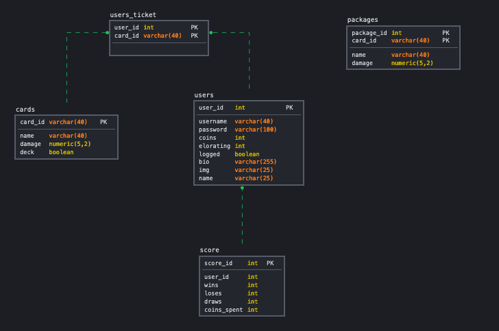

# MTCP
Let's start with the first design that was made for this Project.
Here is the UML:

## UML

But, even though it was almost perfect, still the UML created in the begin was not the final UML used for this project.
This UML helped a lot, it made the work go more smoothly than without it, but what I learned is to not be attached with 
a version that you make. In this case the UML. Yeah, i did the UML in accordance to the UML "rules", but sometimes 
the work became a lot easier if I changed some things. 
The final UML has these changes:
The User Table has no IPlayable interface, because I realized that there will be only one type of player. 
MTPC class has no connection with Client, because all clients requests will be handled by the Server. Also the ServerSecurity
class was not necessary. These were things that needed no division in separate classes.

Also, what surprised me was, even though Client has Stack, Deck and buy Packages, in the UML he has no connection with them. 
Because these data will be saved in the database, there was no need for the Client to have these variables. 
And, the most important thing, since the server is connected with all parts, it is important to test all the objects that will be 
added to this class.

The end result of the UML would be this:

## Database
Database was actually a lot easier than the UML. UML is in the beginning of the project, so a lot of it would be educated guessing.
The database is just creating tables that come during the project. The first database scheme that I did, quite in the beginning, 
is done only by reading the project requirements.

What was added to the database is the "score" table for each user. 
Trading feature was not done, but if it was done, we would only need to add a "trade" table which would have a seperate primary key,
and would have a "connection" with users table.
The columns would be:
- trader_one: reference to the user demanding the trade
- trader_two: reference to the user accepting the trade

The final database scheme I had is this:

## jUnit Testing
The most surprising thing about this whole project was the testing. Before this one, I thought that testing was a bit overrated. 
I thought that if you think of good solutions, testing is not needed. One can see the errors coming without them happening. Maybe that's why
it was hard in previous project to debug. But in this project, thanks to testing, i got a feeling what can go wrong in each class. I encountered 
problems with jUnit tests that, if I hadn't caught them then and there, these problems would take me so much time in the future.

This is where I learned the importance of testing. And of testing the small components firstly. And that
made the coding of the big component, server in my case, easy and smooth. 

First test I did, was really not a test. I created a function (deleteAll()) where I clean all the tables in my database. This made my 
testing easier. 

The tests I did are these:
- configureCardMonsterTest() 
- configureCardSpellTest()
- packageTest() //package can have only 5 cards
- deckTest() //deck can have only 4 cards
- stackAddPackageTest() //is a function that was not used actually, adds a package to the stack
- userRegisterTest() //test to register a user
- deleteUserTest()
- userLogInTest() //check if log in works
- userLoggedTest() //check if the user is logged
- getIdFromUserTest() //check a database function used in more than 10 functions
- decreaseCoinsFromUserTest() //when package is bought, decrease coins
- savePackageTest() //save package in DB test
- deletePackageTest() //delete package, used when user buys it
- buyPackageTest() //user buys package 
- getDeckTest()
- setDeckTest() //very important one
- showIntTakenTest() //show which cards user can't use during battle

## Time spent:

Here you can see the time spent for the project. It is separated in tags and description:

[Click for the document](./docs/time_spent.pdf)

## Link to git:

[Click to open the link](https://github.com/ArberBajraktari/mtcp)
